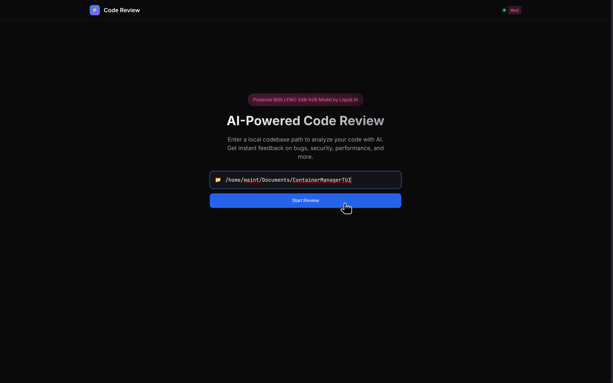

# AI Code Review Agent

<p align="center">
  <strong>Powered With LFM2-24B-A2B Model by Liquid AI</strong>
</p>

<p align="center">
  
</p>

An intelligent, local-first code review system powered by Liquid Foundation Models (LFM2). This agent analyzes your codebase for bugs, security vulnerabilities, performance issues, and best practices violations while keeping all processing on your machine.

---

## Table of Contents

- [Features](#features)
- [About LFM2-24B-A2B](#about-lfm2-24b-a2b)
- [Architecture](#architecture)
- [Prerequisites](#prerequisites)
- [Installation](#installation)
- [Usage](#usage)
- [Configuration](#configuration)
- [API Reference](#api-reference)
- [Screenshots](#screenshots)

---

## Features

- **Local-First Privacy**: All code analysis runs locally through Ollama - your code never leaves your machine
- **Multi-Language Support**: Reviews TypeScript, JavaScript, Python, Go, Rust, Java, C#, PHP, and more
- **Comprehensive Analysis**:
  - Bug detection and logic errors
  - Security vulnerability scanning
  - Performance issue identification
  - Code style and maintainability
  - Type safety checks
  - Error handling patterns
- **External Tool Integration**: Combines LLM analysis with ESLint, TypeScript compiler, and custom security audits
- **Real-Time Progress**: SSE-powered live updates during review sessions
- **Confidence Scoring**: Each finding includes a confidence score to reduce false positives
- **Verification Pass**: Findings are verified by a second LLM pass for accuracy
- **Export Options**: Download results as JSON or Markdown reports

---

## About LFM2-24B-A2B

This code review agent is powered by **LFM2-24B-A2B**, part of Liquid AI's second generation of Liquid Foundation Models.

### What Makes LFM2 Special

Liquid Foundation Models represent a new class of generative AI models built from first principles, drawing from:

- **Dynamical Systems Theory**: LFM2's architecture is rooted in the theory of liquid time-constant networks, enabling adaptive computation
- **Signal Processing**: The models use structured operators derived from decades of signal processing advances
- **Hybrid Architecture**: LFM2 combines multiplicative gates, short convolutions, and grouped query attention in an optimized blend

### Key Advantages

| Feature | Benefit |
|---------|---------|
| **3x Faster Training** | New hybrid architecture accelerates both training and inference |
| **Memory Efficient** | Optimized for resource-constrained environments with near-constant memory complexity |
| **State-of-the-Art Quality** | Outperforms similar-sized models on benchmarks |
| **32K Context Length** | Extended context for analyzing large files and documentation |
| **Deploy Anywhere** | Runs on CPU, GPU, and NPU hardware - perfect for local deployment |

### Technical Architecture

LFM2 uses a hybrid of convolution and attention blocks:
- **16 total blocks**: 10 double-gated short-range LIV convolutions + 6 grouped query attention (GQA) blocks
- **SwiGLU activation** with RMSNorm layers
- **Linear Input-Varying (LIV) operators** for adaptive, input-aware computation

This architecture makes LFM2 particularly well-suited for code analysis tasks requiring:
- Long context understanding
- Precise pattern recognition
- Structured output generation

Learn more at [Liquid AI](https://www.liquid.ai/) and [LFM Documentation](https://docs.liquid.ai/).

---

## Architecture

```
┌─────────────────────────────────────────────────────────────┐
│                     Web Frontend (Next.js)                   │
│                      Port: 3002                              │
└─────────────────────────┬───────────────────────────────────┘
                          │
                          ▼
┌─────────────────────────────────────────────────────────────┐
│                    Backend Server (Bun)                      │
│                      Port: 3001                              │
│  ┌─────────────┐  ┌──────────────┐  ┌──────────────────┐   │
│  │  Session    │  │   Review     │  │  Finding         │   │
│  │  Manager    │  │   Engine     │  │  Consolidator    │   │
│  └─────────────┘  └──────────────┘  └──────────────────┘   │
└─────────────────────────┬───────────────────────────────────┘
                          │
          ┌───────────────┼───────────────┐
          ▼               ▼               ▼
    ┌──────────┐   ┌──────────┐   ┌──────────────┐
    │  Ollama  │   │  ESLint  │   │  TypeScript  │
    │  (LFM2)  │   │          │   │  Compiler    │
    └──────────┘   └──────────┘   └──────────────┘
```

### Project Structure

```
LFM2E2Ev04/
├── apps/
│   ├── server/           # Bun backend server
│   │   └── src/
│   │       ├── server.ts           # Main server entry
│   │       ├── ollamaClient.ts     # LLM integration
│   │       ├── reviewEngine.ts     # Review orchestration
│   │       ├── externalTools.ts    # ESLint, TSC, security audits
│   │       ├── findingConsolidator.ts
│   │       └── prompts/
│   │           └── reviewPrompt.ts # LLM prompts
│   │
│   └── web/              # Next.js frontend
│       └── app/
│           ├── page.tsx           # Main UI
│           ├── layout.tsx
│           └── globals.css
│
├── lfmagent01.png        # Screenshots
├── lfmagent02.png
├── lfmagent03.png
├── lfmagent04.png
└── package.json          # Workspace root
```

---

## Prerequisites

- **[Bun](https://bun.sh/)** >= 1.0.0
- **[Ollama](https://ollama.ai/)** with LFM2 model
- **Node.js** >= 18 (for Next.js)

### Installing Ollama and LFM2

1. Install Ollama:
   ```bash
   # macOS/Linux
   curl -fsSL https://ollama.ai/install.sh | sh
   ```

2. Pull the LFM2 model:
   ```bash
   ollama pull lfm2:24b
   ```

3. Verify Ollama is running:
   ```bash
   ollama list
   ```

---

## Installation

1. Clone the repository:
   ```bash
   git clone <repository-url>
   cd LFM2E2Ev04
   ```

2. Install dependencies:
   ```bash
   bun install
   ```

3. Build the project:
   ```bash
   bun run build
   ```

---

## Usage

### Development Mode

Run both frontend and backend in development:

```bash
bun run dev
```

Or run them separately:

```bash
# Terminal 1 - Backend server
bun run dev:server

# Terminal 2 - Frontend
bun run dev:web
```

### Production Mode

```bash
# Build
bun run build

# Start servers
bun run start:server  # Backend on port 3001
bun run start:web     # Frontend on port 3002
```

### Accessing the Application

- **Frontend**: http://localhost:3002
- **Backend API**: http://localhost:3001
- **Health Check**: http://localhost:3001/health

---

## Configuration

### Environment Variables

Create a `.env` file in the project root or set these variables:

| Variable | Default | Description |
|----------|---------|-------------|
| `PORT` | `3001` | Backend server port |
| `OLLAMA_BASE_URL` | `http://localhost:11434` | Ollama API endpoint |
| `OLLAMA_MODEL` | `lfm2:latest` | Model to use for reviews |

### Example `.env`

```env
PORT=3001
OLLAMA_BASE_URL=http://localhost:11434
OLLAMA_MODEL=lfm2:24b
```

---

## API Reference

### Start Review

```http
POST /api/review/start
Content-Type: application/json

{
  "path": "/path/to/your/project"
}
```

Response:
```json
{
  "sessionId": "abc123",
  "path": "/path/to/your/project",
  "status": "started"
}
```

### Get Session Status

```http
GET /api/review/:sessionId
```

### Get Results

```http
GET /api/review/:sessionId/results
```

### Get Consolidated Results

```http
GET /api/review/:sessionId/results/consolidated
```

### Stream Events (SSE)

```http
GET /api/review/:sessionId/stream
```

Event types:
- `started` - Review started
- `file_start` - Beginning to review a file
- `file_complete` - File review finished
- `progress` - Progress update
- `completed` - All files reviewed
- `error` - Error occurred

### Download Reports

```http
GET /api/review/:sessionId/download/json
GET /api/review/:sessionId/download/markdown
```

---

## Screenshots

<p align="center">
  
</p>

<p align="center">
  
</p>

<p align="center">
  
</p>

---

## How It Works

### 1. Code Discovery
The engine walks your project directory, identifying source files by extension and filtering out common exclusions (node_modules, .git, etc.).

### 2. External Analysis
For supported file types, external tools are run:
- **TypeScript/JavaScript**: ESLint linting and TypeScript type checking
- **Security Audit**: Pattern matching for common vulnerabilities (SQL injection, XSS, hardcoded credentials, etc.)

### 3. LLM Review
Each file is analyzed by LFM2 with:
- Language-specific prompts for targeted analysis
- Context from external tools
- Confidence scoring for each finding

### 4. Verification Pass
High-confidence findings undergo a second verification pass to reduce false positives and correct line numbers.

### 5. Consolidation
Findings across all files are consolidated, with patterns identified when the same issue appears in multiple files.

---

## Technology Stack

- **Server**: Bun, TypeScript, SSE (Server-Sent Events)
- **Web**: Next.js 14, React, TypeScript, Tailwind CSS
- **AI**: Ollama with LFM2 model (OpenAI-compatible API)

---

## License

MIT

---

## Acknowledgments

- **[Liquid AI](https://www.liquid.ai/)** for the LFM2-24B-A2B model
- **[Ollama](https://ollama.ai/)** for local LLM serving
- **[Bun](https://bun.sh/)** for the fast JavaScript runtime
- **[Next.js](https://nextjs.org/)** for the frontend framework
