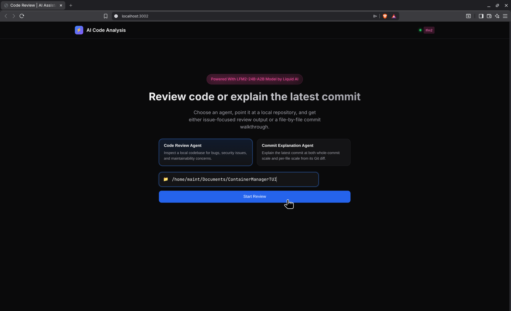
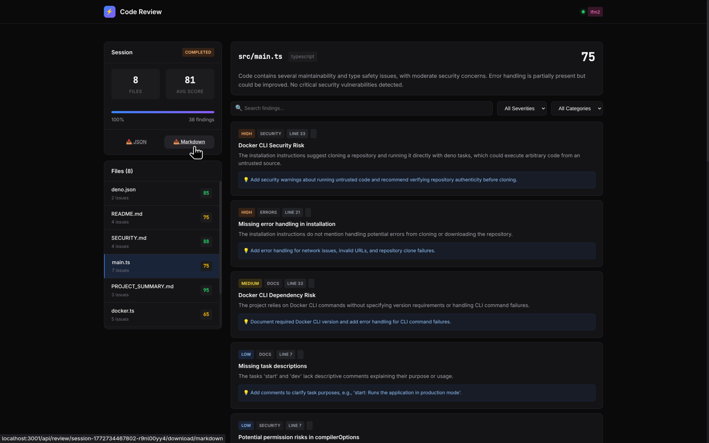
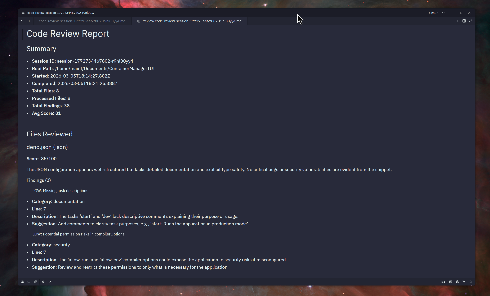
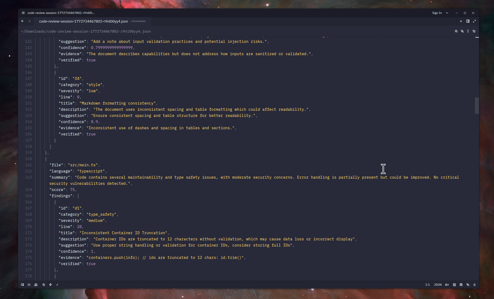
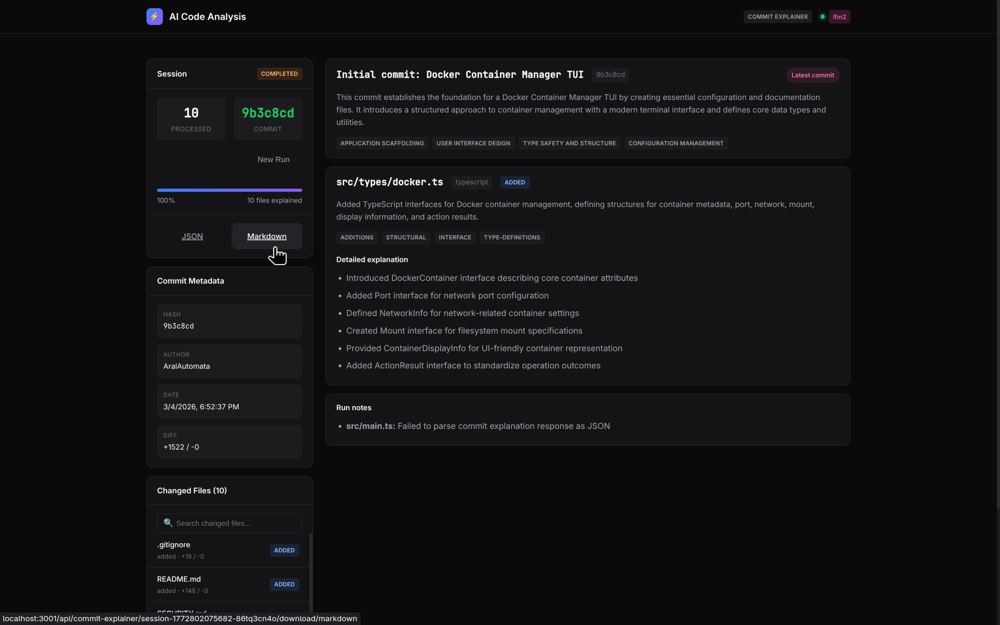
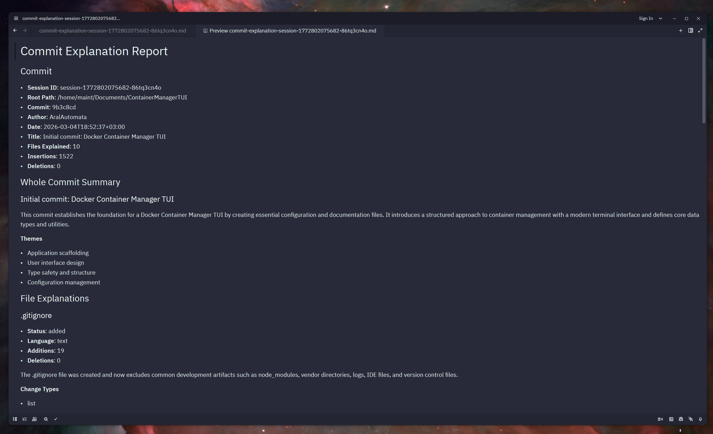
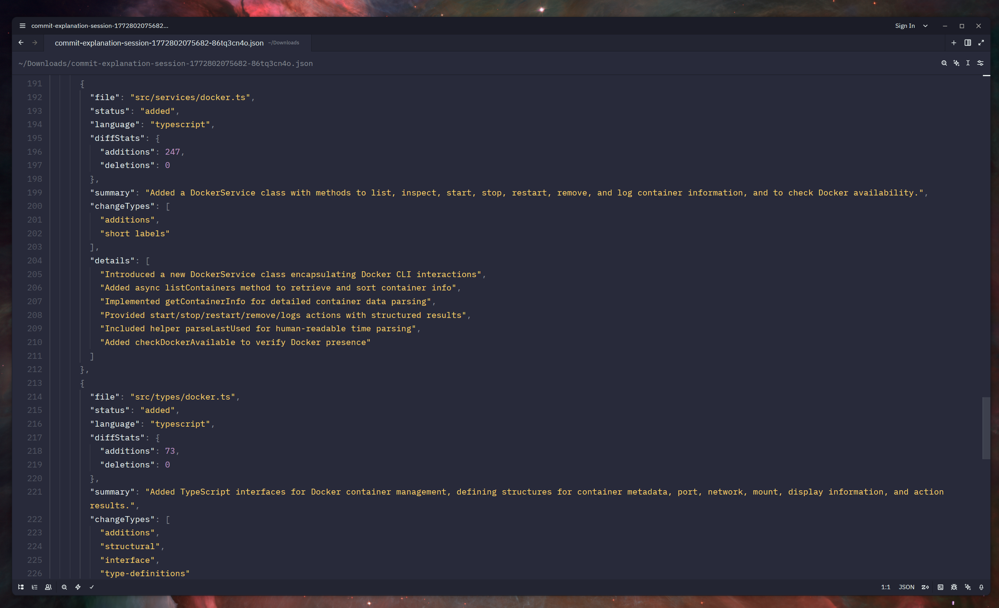

# AI Code Review & Commit Explanation Agent

<p align="center">
  <strong>Powered With LFM2-24B-A2B Model by Liquid AI</strong>
</p>

<p align="center">
  
</p>

An intelligent, local-first code analysis system powered by Liquid Foundation Models (LFM2). The app offers two focused agents in one web UI:

- **Code Review Agent** for bug, security, performance, and maintainability analysis
- **Commit Explanation Agent** for explaining the latest Git commit from its diff, both at whole-commit scale and per-file scale

All analysis runs locally through Ollama so your source code and Git history stay on your machine.

---

## Table of Contents

- [Features](#features)
- [About LFM2-24B-A2B](#about-lfm2-24b-a2b)
- [Architecture](#architecture)
- [Code Review Agent](#code-review-agent)
- [Commit Explanation Agent](#commit-explanation-agent)
- [Prerequisites](#prerequisites)
- [Installation](#installation)
- [Usage](#usage)
- [Configuration](#configuration)
- [API Reference](#api-reference)
- [Screenshots](#screenshots)
- [License](#license)

---

## Features

- **Local-First Privacy**: All analysis runs locally through Ollama.
- **Dual Agent Modes**: Switch between Code Review Agent and Commit Explanation Agent from the same UI.
- **Code Review Analysis**:
  - Bug detection and logic errors
  - Security vulnerability scanning
  - Performance issue identification
  - Code style and maintainability feedback
  - Type safety and error handling checks
- **Commit Explanation Analysis**:
  - Whole-commit "what changed" explanations
  - Detailed per-file explanations for added and modified files
  - Lightweight Git diff analysis using the same `lfm2:latest` model
- **Real-Time Progress**: SSE-powered progress updates with polling fallback.
- **Export Options**: Download JSON or Markdown reports for both agents.

---

## About LFM2-24B-A2B

This project uses **LFM2-24B-A2B**, part of Liquid AI's second generation of Liquid Foundation Models.

### What Makes LFM2 Special

Liquid Foundation Models are built from first principles and draw from:

- **Dynamical Systems Theory**: rooted in liquid time-constant network ideas
- **Signal Processing**: structured operators informed by decades of signal processing work
- **Hybrid Architecture**: grouped query attention combined with short convolution blocks

### Key Advantages

| Feature | Benefit |
|---------|---------|
| **Fast Inference** | Fits the repo's local-first workflow and interactive UI |
| **Memory Efficient** | Works well for lightweight sequential analysis |
| **Strong Long-Context Handling** | Useful for code review and diff explanation |
| **Deploy Anywhere** | Runs locally through Ollama on supported hardware |

Learn more at [Liquid AI](https://www.liquid.ai/) and [LFM Documentation](https://docs.liquid.ai/).

---

## Architecture

```
┌─────────────────────────────────────────────────────────────┐
│                     Web Frontend (Next.js)                  │
│        Mode selector + review dashboard + commit UI         │
│                         Port: 3002                          │
└─────────────────────────┬───────────────────────────────────┘
                          │
                          ▼
┌─────────────────────────────────────────────────────────────┐
│                    Backend Server (Bun)                     │
│                         Port: 3001                          │
│  ┌─────────────┐  ┌──────────────┐  ┌──────────────────┐   │
│  │  Session    │  │ Review       │  │ Commit           │   │
│  │  Manager    │  │ Engine       │  │ Explainer        │   │
│  └─────────────┘  └──────────────┘  └──────────────────┘   │
└─────────────────────────┬───────────────────────────────────┘
                          │
          ┌───────────────┼───────────────┬────────────────┐
          ▼               ▼               ▼                ▼
    ┌──────────┐   ┌──────────┐   ┌──────────────┐   ┌──────────┐
    │  Ollama  │   │  ESLint  │   │ TypeScript   │   │   Git    │
    │  (LFM2)  │   │          │   │ Compiler     │   │ Diff/HEAD│
    └──────────┘   └──────────┘   └──────────────┘   └──────────┘
```

### Project Structure

```text
LFM2E2Ev04/
├── apps/
│   ├── server/
│   │   └── src/
│   │       ├── server.ts
│   │       ├── reviewEngine.ts
│   │       ├── commitExplainer.ts
│   │       ├── gitCommitReader.ts
│   │       ├── ollamaClient.ts
│   │       └── prompts/
│   │           ├── reviewPrompt.ts
│   │           └── commitExplainPrompt.ts
│   └── web/
│       └── app/
│           ├── page.tsx
│           ├── layout.tsx
│           └── globals.css
├── lfmagent01.png
├── lfmagent02.png
├── lfmagent03.png
├── lfmagent04.png
└── package.json
```

### Analysis Flow

**Code Review Agent**

1. Walks the target directory and filters supported source files.
2. Runs review prompts against Ollama.
3. Optionally augments review context with external tooling for supported JS/TS files.
4. Streams progress and returns findings plus exports.

**Commit Explanation Agent**

1. Validates the target path is a Git repository.
2. Reads the latest commit only: `HEAD`.
3. Collects only `added` and `modified` files from that commit.
4. Explains each eligible file sequentially from its unified diff.
5. Builds one whole-commit summary from compact per-file summaries.
6. Streams progress and returns JSON/Markdown exports.

---

## Code Review Agent

The **Code Review Agent** is built for issue-focused analysis of a local codebase. It examines source files and returns structured findings about correctness, security, performance, and maintainability.

### What It Does

It analyzes supported files in a target project and produces:

- a **per-file review summary**
- a **score** for each reviewed file
- structured **findings** with severity, category, description, and suggestion
- downloadable **JSON** and **Markdown** reports

This is useful when you want to:

- scan a project for likely bugs and unsafe patterns
- find maintainability and type-safety issues quickly
- review a repository before shipping or opening a pull request
- get an AI-assisted pass over multiple files without sending code to a hosted service

### When To Use It vs Commit Explanation

Use **Code Review Agent** when you want to answer:

- What is risky or incorrect in this codebase?
- Which files contain actionable findings?
- Are there security, performance, or maintainability issues?

Use **Commit Explanation Agent** when you want to answer:

- What changed in the latest commit?
- How should I understand the scope of one recent change?
- Which modified files were touched and what changed in each one?

### How It Works

The review flow uses the same Ollama-backed `lfm2:latest` model and adds lightweight tool-assisted context when appropriate:

- walks the provided directory and filters supported source files
- reviews files individually through the model
- augments supported JS/TS files with TypeScript, ESLint, and security-audit context when available
- emits live progress updates and stores file-by-file results in memory for UI display and exports

### Current Limits / Notes

The current implementation is intentionally lightweight and favors predictable local execution:

- **Project path input**: the target path should point to a local codebase directory
- **Supported-file filtering**: excluded directories and unsupported extensions are skipped
- **Large files are skipped**: very large files are not sent to the model
- **Sequential processing**: files are processed one at a time to keep resource use stable
- **External tools are best-effort**: missing ESLint or TypeScript configuration does not stop the full run

## Screenshots of Code Review Agent

<p align="center">
  
</p>

<p align="center">
  
</p>

<p align="center">
  
</p>

---

## Commit Explanation Agent

The **Commit Explanation Agent** is designed for understanding what the latest commit changed without switching to a manual `git show` workflow.

### What It Does

It reads the latest commit diff and produces:

- a **whole-commit summary** describing the overall intent and visible changes
- a **per-file explanation** for each added or modified file
- downloadable **JSON** and **Markdown** reports

This is useful when you want to:

- understand a teammate's most recent commit quickly
- review a commit's scope before deeper code review
- generate a change summary without writing it by hand
- inspect documentation, configuration, UI, or implementation changes from one place

### When To Use It vs Code Review

Use **Commit Explanation Agent** when you want to answer:

- What changed in the latest commit?
- Which files were touched and why?
- What is the high-level story of this change?

Use **Code Review Agent** when you want to answer:

- Is this code risky or incorrect?
- Are there security, performance, or maintainability issues?
- Which files contain actionable findings?

### How It Works

The feature uses the same Ollama-backed `lfm2:latest` model as the review agent, but follows a lighter path:

- reads Git metadata and unified diff output from `HEAD`
- includes only `added` and `modified` files
- explains files sequentially to keep memory and token usage predictable
- generates the whole-commit summary from compact file summaries instead of re-sending the full diff

### Current Limits / Notes

The current implementation intentionally stays lightweight and only documents shipped behavior:

- **Latest commit only**: it always explains `HEAD`
- **Git repository required**: the provided path must be inside a valid Git worktree
- **Added/modified files only**: deleted and rename-only paths are not explained in v1
- **Binary diffs are skipped**: the report will note when a file could not be explained textually
- **Large diffs may be truncated**: oversized per-file diffs are shortened before being sent to the model
- **Sequential processing by design**: this keeps resource usage lower than a broad parallel analysis pass

## Screenshots of Commit Explanation Agent

<p align="center">
  
</p>

<p align="center">
  
</p>

<p align="center">
  
</p>

---

## Prerequisites

- **[Bun](https://bun.sh/)** >= 1.0.0
- **[Ollama](https://ollama.ai/)** with an LFM2 model available locally
- **Node.js** >= 18 for the Next.js frontend
- **Git** available on your system path for the Commit Explanation Agent

### Installing Ollama and LFM2

1. Install Ollama:
   ```bash
   # macOS/Linux
   curl -fsSL https://ollama.ai/install.sh | sh
   ```

2. Pull the model:
   ```bash
   ollama pull lfm2:24b
   ```

3. Verify Ollama is running:
   ```bash
   ollama list
   ```

---

## Installation

1. Clone the repository:
   ```bash
   git clone <repository-url>
   cd LFM2E2Ev04
   ```

2. Install dependencies:
   ```bash
   bun install
   ```

3. Build the workspace:
   ```bash
   bun run build
   ```

---

## Usage

### Development Mode

Run both frontend and backend:

```bash
bun run dev
```

Or run them separately:

```bash
# Terminal 1 - Backend server
bun run dev:server

# Terminal 2 - Frontend
bun run dev:web
```

### Production Mode

```bash
bun run build

# Backend on port 3001
bun run start:server

# Frontend on port 3002
bun run start:web
```

### Accessing the Application

- **Frontend**: http://localhost:3002
- **Backend API**: http://localhost:3001
- **Health Check**: http://localhost:3001/health

### Using the Code Review Agent

1. Open the web UI at `http://localhost:3002`
2. Select **Code Review Agent**
3. Enter a local project path
4. Start the review
5. Watch file-by-file progress, inspect findings, and download JSON or Markdown output

### Using the Commit Explanation Agent

1. Open the web UI at `http://localhost:3002`
2. Select **Commit Explanation Agent**
3. Enter the path to a local Git repository
4. Click **Explain Latest Commit**
5. The UI will:
   - validate the repository
   - read the latest commit from `HEAD`
   - explain each added/modified file
   - generate one whole-commit summary
6. Review the results:
   - whole-commit explanation at the top
   - commit metadata in the sidebar
   - per-file explanations in the changed-files list
7. Download the session as JSON or Markdown once the run completes

### Commit Explanation Output

Each successful commit explanation session includes:

- **Commit metadata**: short hash, author, date, title, insertion/deletion totals
- **Whole-commit summary**:
  - headline
  - overview
  - themes
  - optional risks or follow-up notes
- **Per-file explanations**:
  - file path
  - status (`added` or `modified`)
  - language
  - diff stats
  - short summary
  - change types
  - detailed explanation bullets

---

## Configuration

Create a `.env` file in the project root or set these variables directly:

| Variable | Default | Description |
|----------|---------|-------------|
| `PORT` | `3001` | Backend server port |
| `OLLAMA_BASE_URL` | `http://localhost:11434` | Ollama API endpoint |
| `OLLAMA_MODEL` | `lfm2:latest` | Model used by both agents |

### Example `.env`

```env
PORT=3001
OLLAMA_BASE_URL=http://localhost:11434
OLLAMA_MODEL=lfm2:24b
```

---

## API Reference

### Code Review Agent

#### Start Review

```http
POST /api/review/start
Content-Type: application/json

{
  "path": "/path/to/your/project"
}
```

#### Session and Results

```http
GET /api/review/:sessionId
GET /api/review/:sessionId/results
GET /api/review/:sessionId/results/consolidated
GET /api/review/:sessionId/stream
GET /api/review/:sessionId/download/json
GET /api/review/:sessionId/download/markdown
```

Event types:

- `started`
- `file_start`
- `file_complete`
- `progress`
- `completed`
- `error`

### Commit Explanation Agent

#### Start Commit Explanation

```http
POST /api/commit-explainer/start
Content-Type: application/json

{
  "path": "/path/to/your/git-repo"
}
```

#### Get Commit Session Status

```http
GET /api/commit-explainer/:sessionId
```

#### Get Commit Explanation Results

```http
GET /api/commit-explainer/:sessionId/results
```

#### Stream Events and Downloads

```http
GET /api/commit-explainer/:sessionId/stream
GET /api/commit-explainer/:sessionId/download/json
GET /api/commit-explainer/:sessionId/download/markdown
```

The commit explainer uses the same event types as the review flow:

- `started`
- `file_start`
- `file_complete`
- `progress`
- `completed`
- `error`

---

## License

This project is licensed under the **MIT License**.
